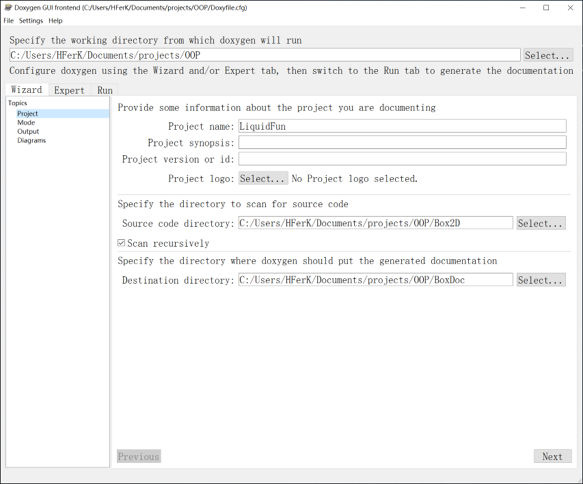
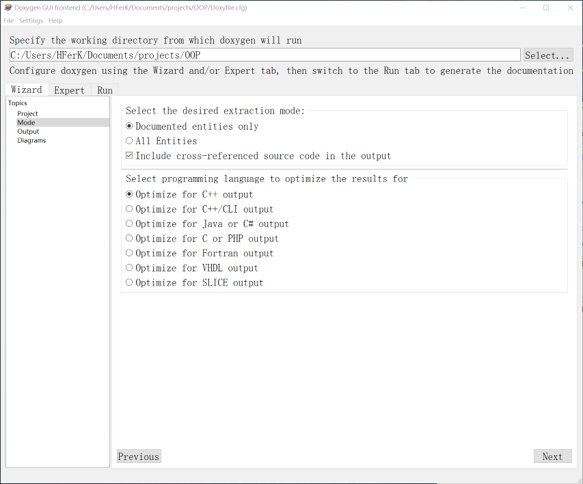
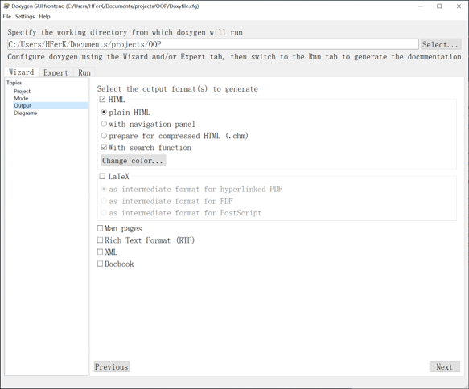
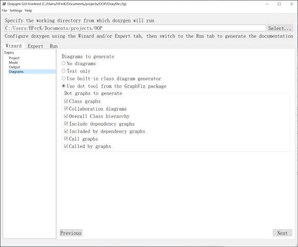
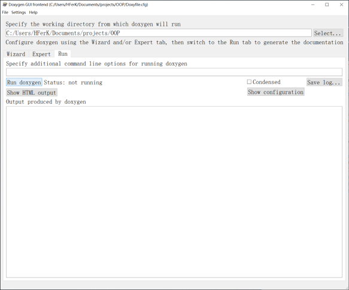
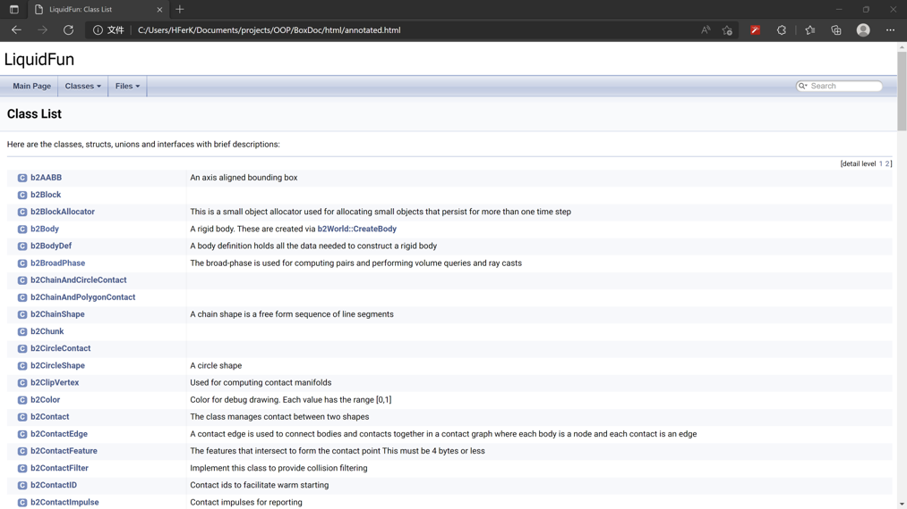
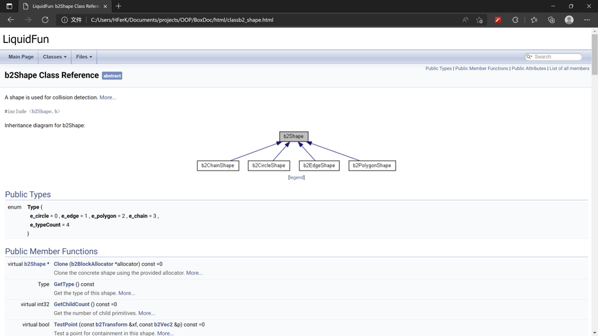
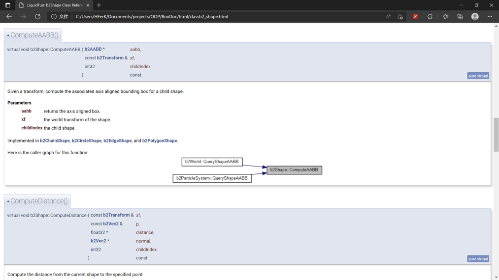

# Doxygen简介

## 为什么需要Doxygen？

在编写需要给其他用户使用的项目时，编写说明文档对于正确地使用项目非常重要，但是对于大型项目来说，手动编写说明文档并不现实。

为了解决这一问题，Doxygen可以通过直接分析代码来生成项目中类、函数、变量等关键要素的关联关系，并通过处理代码中带有特定格式的注释来生成说明文档，如Javadoc风格注释、Qt风格注释和C++注释块。

## Javadoc风格注释

Javadoc风格的注释原本使为了生成Java代码的说明文件而设计的注释格式，其格式时由C风格的注释块更改而来，因此也可以在C++等语言中使用。

Javadoc风格的注释块以`/**`开头，`*/`结束，中间的每一行都以`*`开始。在注释块中可以使用一些以`@`开头的标签标记特定信息，下表展示了部分可用的标签。

|标签|内容|标签|内容|
|:--:|:--:|:--:|:--:|
|`@brief`|简短说明|`@see`|另请参阅|
|`@param`|函数参数|`@author`|文件作者|
|`@tparam`|函数模板参数|`@version`|版本|
|`@return`|函数返回值|`@since`|从以下版本开始|

注释应当放在类或者函数声明之前，注释块中未加标签的注释默认为详细描述。

示例：

```cpp
/**
 * @file Example.h
 * @author Zhang Hongyi (hy-zhang20@mails.tsinghua.edu.cn)
 * @brief Header file for OOP in-class talk. 
 * @version 0.1
 * @date 2022-04-28
 */

/**
 * @brief An Example Class
 * A more detailed description here.
 */
class Example
{
private:
    int m_example;
public:
    /**
     * @brief Construct a new Example object
     * 
     * @param example Input value for m_example
     */
    Example(int example) : m_example(example){}
    /**
     * @brief A function template
     * 
     * @tparam T A template
     * @param temp A template value
     * @return T The returned value
     */
    template <typename T> T Return(T temp){ return temp; }
};
```

在VSCode中可使用Doxygen Document Generator插件帮助添加注释，默认为Javadoc风格。

## Doxygen安装

前往[官方网站](https://www.doxygen.nl/)根据所使用的操作系统进行安装。

若需要生成类继承图等图表，则需要安装[Graphviz](https://graphviz.org/)并将其添加至系统路径。

在Windows系统中，安装完成后打开Doxywizard即可开始配置项目。

## Doxygen使用

### 配置项目基本信息

在Doxywizard中Wizard一栏的Project选项中选择工作路径，输入项目信息，选择源代码目录，选择说明文档目录。



在Mode选项中选择项目的编程语言。



在Output选项中选择说明文档的输出格式。



在Diagram选项中选择说明文档中图表的输出格式。



### 运行Doxygen

配置完成后，在Doxywizard中Run一栏点击Run doxygen即可开始运行。



## Doxygen说明文档展示

以下展示的是使用Doxygen生成的Liquidfun库说明文档。




